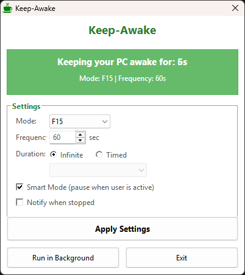
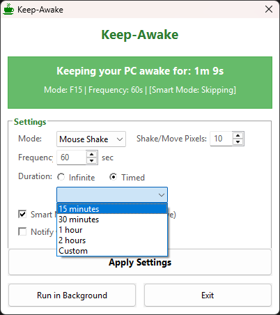

# ☕ Keep-Awake

> Your PC's personal coffee! Never sleep again! ☕💻

[](https://github.com/Ketan-K/keep-awake/releases)
[](https://opensource.org/licenses/MIT)
[](https://github.com/Ketan-K/keep-awake)
[](https://github.com/Ketan-K/keep-awake/releases)

Keep-Awake is a lightweight, feature-rich tool that prevents your Windows PC from going to sleep. With multiple keep-awake modes, smart user detection, and a beautiful material design interface, it's the perfect solution for keeping your status "Active" during presentations, long downloads, or when you just need your computer to stay awake!

## 📸 Screenshots

<p align="center">
  
  <br>
  <em>Main interface with material design and all settings</em>
</p>

<p align="center">
  
  <br>
  <em>Timed mode showing countdown timer</em>
</p>

<p align="center">
  
  <br>
  <em>Smart mode actively detecting and skipping when user is active</em>
</p>

## ✨ Features

### 🎨 Modern Material Design UI
- Clean green and white interface with proper alignment
- Real-time status updates with countdown timer
- Consolidated settings panel with intuitive layout
- Always-on-top status window with tray integration

### ⏱️ Duration Control
- **Infinite Mode** - Run continuously until manually stopped
- **Timed Mode** - Auto-stop after set duration
- Quick presets: 15 min, 30 min, 1 hour, 2 hours
- Custom duration support (1-1440 minutes)
- Real-time countdown display

### 🖱️ Multiple Keep-Awake Modes
- **F15 Key** (Default) - Silent, non-intrusive key press
- **Mouse Shake** - Quick horizontal mouse shake
- **Mouse Move** - Diagonal mouse movement  
- **Key Press** - Shift key press (harmless)

### 🧠 Smart Mode
- Automatically detects user activity
- Pauses keep-awake when you're using your PC
- Real-time skip indicator in status panel
- 10-second idle threshold detection

### 🔔 Notifications & Feedback
- Optional notification when timed session ends
- Visual feedback on settings changes
- System tray integration with coffee icon
- Live statistics and uptime tracking

### 🎯 Additional Features
- 📊 **Real-time Monitoring** - Live stats with formatted time display
- 🎯 **Dual Mode** - GUI mode by default, CLI mode with arguments
- 🤫 **Quiet Mode** - Run silently in the background
- 📦 **Truly Portable** - Single standalone .exe (~1.2MB)
- 🚀 **Lightweight** - Minimal resource usage

## 🚀 Quick Start

### Option 1: Use Pre-built Executable (Recommended!)

1. Download `keep-awake.exe` from [Releases](https://github.com/Ketan-K/keep-awake/releases)
2. **Double-click to launch** - Opens a GUI status window!
   - Shows running time (e.g., "2m 30s")
   - Displays mouse shake statistics
   - Click "Run in Background" to minimize to tray
   - Click "Exit" to close the application

3. Or run from command line for CLI mode:
   ```bash
   keep-awake.exe --interval 30 --shake-size 5
   ```

> **✨ Truly Portable:** Single .exe file (~1.2MB) with embedded coffee icon - works anywhere on Windows!

### Option 2: Run from Source

```bash
# Clone the repository
git clone https://github.com/Ketan-K/keep-awake.git
cd keep-awake

# Run the AutoHotkey script directly (requires AutoHotkey v1.1)
"C:\Program Files\AutoHotkey\AutoHotkey.exe" keep-awake.ahk

# Or edit keep-awake.ahk with any text editor and customize
```

## 🎮 Usage

### GUI Mode (Default)

Simply double-click `keep-awake.exe` to launch the beautiful interface:

**Main Interface Features:**
- 🎨 **Material Design** - Clean green and white theme
- ⏱️ **Duration Settings** 
  - Choose Infinite or Timed mode
  - Quick presets (15/30/60/120 minutes) or custom duration
  - Real-time countdown when in timed mode
- 🖱️ **Mode Selection**
  - F15 Key (default, silent)
  - Mouse Shake (horizontal)
  - Mouse Move (diagonal)
  - Key Press (Shift key)
- 🔧 **Smart Controls**
  - Shake/Move size (only shown for mouse modes)
  - Frequency adjustment (1-3600 seconds)
- 🧠 **Smart Mode** - Auto-detects user activity and pauses
- 🔔 **Notifications** - Optional alert when session ends
- 📊 **Live Status** - Shows mode, frequency, and remaining time

**Tray Icon Features:**
- Coffee cup icon in system tray
- Right-click → "Open" to show window
- Right-click → "Exit" to close
- Hover for tooltip with stats

### CLI Mode (Advanced)

Run with arguments to use command-line mode with table output:

```bash
keep-awake.exe [options]

Options:
  --interval <seconds>    Set interval between shakes (default: 60)
  --shake-size <pixels>   Set shake distance (default: 10)
  --quiet                 Suppress console output
  --help                  Show help message

Examples:
  keep-awake.exe                              # GUI mode (default)
  keep-awake.exe --interval 30 --shake-size 5 # CLI mode with custom settings
  keep-awake.exe --quiet                      # CLI silent mode
  keep-awake.exe --help                       # Show help
```

### Configuration Options

| Option | Description | Default | Range |
|--------|-------------|---------|-------|
| `--interval` | Time between shakes (seconds) | 60 | 1-3600 |
| `--shake-size` | Shake distance in pixels | 10 | 1-100 |
| `--quiet` | Suppress all console output (CLI mode only) | false | - |
| `--help` | Display help message | - | - |

### CLI Mode Output Example

When run with arguments, displays running status:

```
================================
KEEP-AWAKE is running
Interval: 60s | Shake Size: 10px
================================

Mouse shakes performed every 60 seconds...
Press Ctrl+C to exit
```

**Note:** The shake motion moves the mouse slightly right and immediately back to its original position. No position tracking is shown in CLI mode since the mouse returns to where it started.

## 🔨 Building from Source

### Prerequisites
- [AutoHotkey v1.1](https://www.autohotkey.com/) installed
- Node.js (for build script only)

### Build Steps

```bash
# Clone the repository
git clone https://github.com/Ketan-K/keep-awake.git
cd keep-awake

# Build the executable
npm run build

# Output: dist/keep-awake.exe (~1.2MB standalone file)
```

### Manual Build

```bash
# Compile with AutoHotkey
"C:\Program Files\AutoHotkey\Compiler\Ahk2Exe.exe" /in keep-awake.ahk /out keep-awake.exe /icon keep-awake.ico
```

**Note:** The `keep-awake.ico` coffee cup icon is included in the repository and embedded into the executable during compilation.

## 🎯 Use Cases

- 📊 **Presentations** - Keep screen active during long demos with timed auto-stop
- 💬 **Teams/Slack** - Stay "Active" while reading documentation (Smart Mode pauses when you type!)
- 📥 **Downloads** - Prevent sleep during large file transfers with custom duration
- 🎥 **Streaming** - Keep PC awake during broadcasts with F15 mode (silent)
- 📚 **Reading** - No interruptions while deep in articles
- 🧪 **Testing** - Long-running automated tests or builds
- ☕ **Coffee Breaks** - Set a timer and get notified when it's time to come back!

## 🎨 GUI Features

**v2.0 Material Design Interface:**
- 🎨 **Modern Layout** - Green and white theme with proper grid alignment
- ⏱️ **Duration Control** - Infinite or Timed with countdown display
- 🖱️ **4 Keep-Awake Modes** - F15, Mouse Shake, Mouse Move, Key Press
- 🧠 **Smart Mode** - Auto-detects user activity with skip indicator
- 🔔 **Notifications** - Optional alerts when session ends
- 📊 **Real-time Stats** - Live uptime, mode, frequency, and remaining time
- 🎯 **Dynamic Controls** - Shake size only shows for mouse modes
- ☕ **Tray Integration** - Coffee cup icon with quick access
- ✅ **Visual Feedback** - "Applied!" confirmation on settings changes
- 🔄 **Single Instance** - Prevents multiple windows
- 📌 **Always On Top** - Option to keep window visible (can minimize to tray)

## ⚠️ Disclaimer

This tool is intended for **legitimate personal use** only. Please use responsibly and in accordance with your workplace policies. The author is not responsible for any misuse of this software. 

Remember: The best way to stay active is to actually *be* active! This tool is for those moments when you genuinely need your PC awake but can't interact with it. 😊

## 📝 License

This project is licensed under the MIT License - see the [LICENSE](LICENSE) file for details.

## 🤝 Contributing

Contributions, issues, and feature requests are welcome! Feel free to check the [issues page](https://github.com/Ketan-K/keep-awake/issues).

1. Fork the project
2. Create your feature branch (`git checkout -b feature/AmazingFeature`)
3. Commit your changes (`git commit -m '✨ Add some AmazingFeature'`)
4. Push to the branch (`git push origin feature/AmazingFeature`)
5. Open a Pull Request

## 💖 Show Your Support

Give a ⭐️ if this project kept your PC awake!

---

<p align="center">Made with ☕ by <a href="https://github.com/Ketan-K">Ketan-K</a></p>
<p align="center">Keep calm and stay awake! 😴➡️😃</p>
